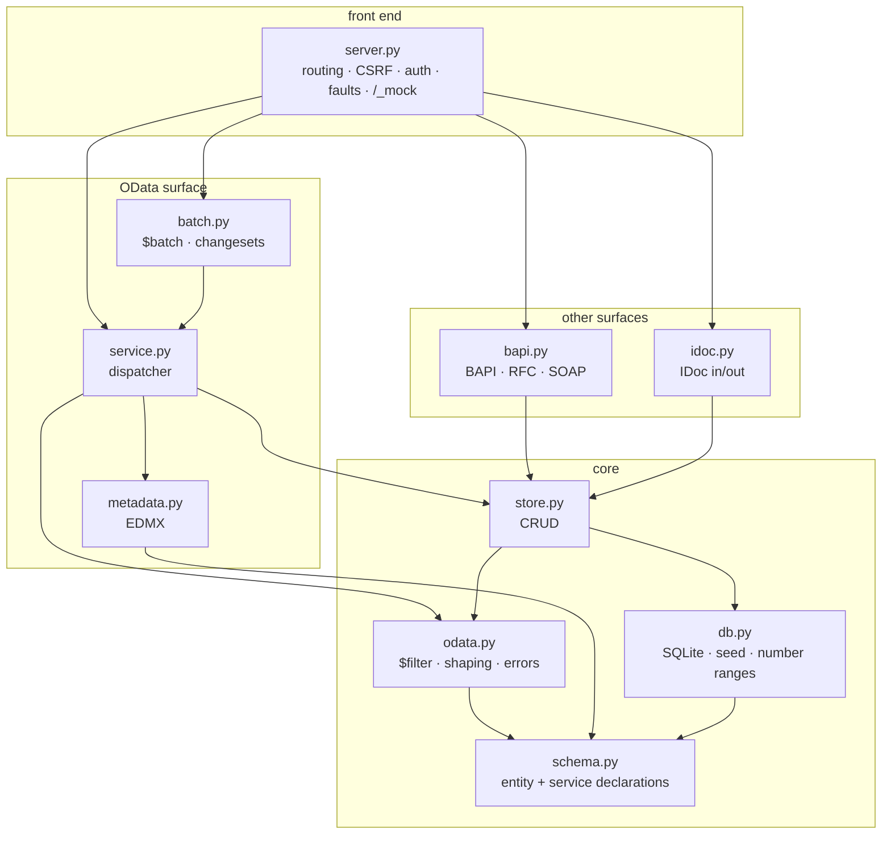
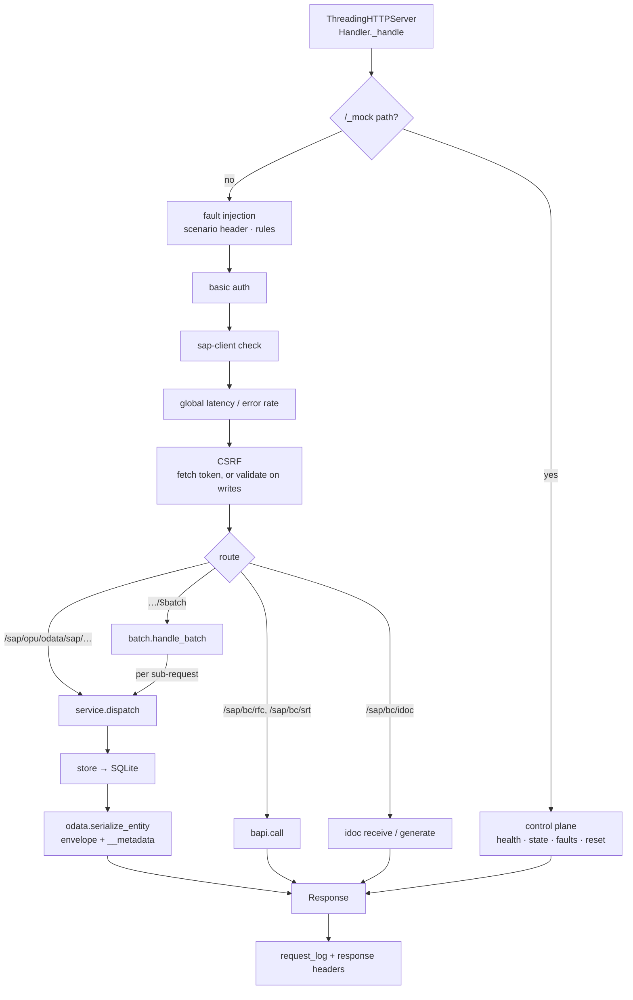

# Architecture

## What this thing is

A black box that speaks SAP's wire shapes. It receives requests in the formats an
SAP system accepts and answers in the formats an SAP system produces - and in
between it does nothing an SAP system would do. There is no ATP check, no pricing
procedure, no output determination, no authorization object. A sales order is a row.

That constraint is the design: every decision below optimises for *fidelity at the
boundary* and *simplicity behind it*.

Two more constraints shape everything:

- **No dependencies.** The Python standard library and SQLite, nothing else. A mock
  you cannot install is a mock nobody runs, so `python3 -m mocksap` works on a bare
  interpreter, in a locked-down CI image, behind a corporate proxy.
- **One source of truth for the shapes.** The entity definitions in `schema.py`
  drive the database schema, the `$metadata` document, the JSON payloads and the
  key handling. They cannot drift apart, because there is only one of them.

## The shape of the code

The arrows only ever point downwards. `schema.py` imports nothing from the package;
`server.py` imports nearly all of it. There are no cycles, which is what makes it
possible to test the dispatcher without a socket and the store without HTTP.

## The path of a request

Two things are worth pointing at.

**The cross-cutting checks run in a fixed order, and the order is deliberate.**
Fault injection comes first so that a simulated outage does not depend on
authenticating successfully; a real backend that is down is down for everyone. CSRF
comes last of the checks, because Gateway itself only validates the token once it
knows who you are.

**`service.dispatch()` takes a method, a path, a query string, headers and a body -
not an HTTP request object.** That is what lets `$batch` reuse the entire OData
implementation: a batch sub-request is parsed out of the multipart body and handed
to the same function the socket-facing handler calls. There is no second code path
for batched operations to drift away from.

## Decisions worth knowing about

### The schema is data, not code

`EntityType`/`Prop`/`Nav`/`Service` are plain dataclasses. `db.ddl_for()` turns an
entity type into `CREATE TABLE`, `metadata.metadata_document()` turns it into EDMX,
`odata.serialize_entity()` turns a row into the JSON an SAP client expects, and
`store` uses the key declarations to build predicates. Adding an entity set means
adding a declaration; nothing else has to be taught about it.

### `$filter` compiles to parameterised SQL

The filter parser is a small recursive-descent parser over a regex tokenizer,
producing a SQL `WHERE` fragment plus a list of bind values. Values are *never*
interpolated into SQL.

Each parse result is a `_Frag` that carries its own parameters in placeholder
order. That matters more than it looks: `endswith(a, b)` renders `b` twice in the
generated SQL, so the fragment has to contribute its bind value twice, in the right
position. An earlier version kept one shared parameter list and silently misbound
those queries - the fragment design makes the class of bug impossible rather than
merely fixed.

Filtering across navigation paths is rejected with a clear error rather than
half-supported.

### Changesets are atomic, via a snapshot

OData says a `$batch` changeset either fully applies or does not apply at all.
Implementing that with SQLite savepoints does not work here, because `store` commits
as it goes. So `batch._run_changeset()` takes a snapshot of the whole database with
SQLite's online backup API before the changeset runs, and restores it if any request
inside fails. The databases involved are small and the mock is not a production
store, which makes the blunt approach the right one.

### SAP's system behaviour is modelled where it is observable

A client cannot tell whether pricing ran, but it can tell whether the document
number came from a number range, whether items are numbered 10/20/30, whether
`TotalNetAmount` reflects the items, and whether unset fields come back as `""` and
`0.000` rather than `null`. So `store.py` implements exactly those: `AUTO_KEY` draws
document numbers, `_next_item_number` numbers items, `_recalculate_totals` keeps the
header consistent, `DOCUMENT_DEFAULTS` sets statuses the system would set, and
`_initial()` returns ABAP initial values. Anything the wire cannot reveal is absent.

### Two dialects, one implementation

A V4 service is not a second mock. `Service.version` picks the dialect, and
everything below the wire - the schema, the store, the `$filter` compiler, ETags,
the fault injection - is the same code serving the same rows, which is why a sales
order written through the V2 service reads back through the V4 one.

What differs is shaping, and that lives in two modules that mirror each other:
`odata.py`/`metadata.py` for V2, `odata4.py`/`metadata4.py` for V4. The dispatcher
branches at the few points where a response is constructed rather than forking, so
a new URL shape or query option is implemented once.

An entity type can belong to a V2 and a V4 service at once - all four A2X APIs do -
so `_service_of()` resolves an expanded type to the service handling the request
first, and after that only to one of the same dialect. Falling through to the other
dialect would put V2 URLs, and V2 shapes, inside a V4 response.

The dialects are kept apart deliberately: `$inlinecount` on a V4 service and
`$count=true` on a V2 one are both errors that name the dialect the option belongs
to, because a mock that quietly accepted either would let a client ship code that a
real system rejects.

### $apply is a plan, not a calculation

An aggregation could have been computed in Python over rows fetched from SQLite.
It is not: `apply.py` parses the pipeline into a plan - a WHERE, grouping columns,
aggregate expressions, an ORDER BY and a LIMIT - and emits one `GROUP BY`
statement. SQLite does the arithmetic, which is both faster and less code to get
wrong, and it is only possible because the `$filter` compiler already turns
expressions into SQL rather than into predicates.

The rows that come back are not entities, and the code is careful about that:
they carry the grouping keys and the aggregates and nothing else - no ETag, no
key, no navigation - because a client that receives an entity-shaped thing will
try to use it as one. The `@odata.context` names the columns produced, which is
how a V4 client knows what it is looking at.

### Structured properties are flat underneath

SAP nests structured properties on the wire - `Address` is a `CT_Address` with its
own `__metadata.type` - but a column per sub-property keeps the database, the
`$filter` compiler and the CRUD layer working in exactly one currency: columns.
`EntityType.columns()` is the seam. It flattens `Address` into `Address_City`,
`Address_PostalCode` and so on, and everything that touches storage iterates it
rather than the declared properties. `EntityType.resolve()` is the inverse, turning
the `Address/City` of a `$filter`, `$orderby` or `$select` back into a column, so
paths cost the query layer nothing.

Only the edges know about nesting: `_complex_value()` rebuilds the structure on the
way out, `_flatten_complex()` takes it apart on the way in. A MERGE that names some
sub-properties leaves the others alone, which is the behaviour a client patching one
line of an address expects; a PUT resets the whole structure, as it does for every
other property.

### Links are a surface of their own

`$links` addresses an association rather than the entities behind it, so a read
answers with bare URIs and a write carries only `{"uri": …}`. The writes do not get
their own rule: `_write_link` works out which row owns the foreign key - the
dependent for a to-many navigation, this row for a to-one - and hands the change to
`store.update`, which already refuses to rewrite a key property. Every association
in the current schema is a composition (a sales order item's key contains its
order), so in practice re-pointing one is refused, exactly as SAP refuses it, while
setting a link to the target it already has succeeds.

### Concurrency is derived, not stored

There is no ETag column. A property can declare itself the concurrency token -
`ConcurrencyMode="Fixed"` in EDM terms - and `etag_for()` renders the ETag from the
values of those properties, so the validator cannot fall out of step with the row it
describes. For the three document types that carry a `LastChangeDate` that yields
SAP's spelling, `W/"datetime'2026-01-15T09%3A41%3A00'"`.

Deriving it does introduce one hazard: two updates inside the same millisecond would
leave the timestamp, and therefore the ETag, unchanged, and a stale validator would
wrongly match. `store._advance()` closes that by nudging the timestamp forward
whenever it would not otherwise move, which makes the ETag strictly monotonic.

Whether a missing `If-Match` is tolerated is a service setting rather than a law:
classic Gateway services accept the write, newer ones refuse it with 428.
`--require-if-match` picks, and the default is the lenient one so that existing
clients keep working.

### Authentication is a flow, not a secret

`--oauth` puts a mock authorization server in front of the mock: a token endpoint,
bearer validation, refresh with rotation, revocation. What it does not do is
cryptography. Tokens are opaque strings held in memory and a SAML assertion is read
for its `NameID` and otherwise believed - no signature, no issuer, no clock skew.
The thing worth testing on the client side is the *flow* - fetch, use, notice a 401,
refresh, retry - and that is what the mock makes exercisable, with `--token-ttl`
turning "eventually" into "in one second".

Two ordering details carry weight. The token endpoint sits in front of the auth
check and in front of CSRF, because a client cannot present the credential it is
asking for; getting this wrong makes the whole flow unusable, and it did, once.
And the principal rides along: the user a token carries becomes `ctx.user`, so a
document created with a SAML-derived token names that user in `CreatedByUser`.

### An inbound IDoc can post, not just arrive

Filing an IDoc and answering 53 is easy and teaches a client nothing about the
half of the loop that matters. A `DELVRY07` names the document each item came from
in `VGBEL`/`VGPOS`, which is enough to do what posting a delivery does: compare the
delivered quantities against the order's items and move `OverallDeliveryStatus` to
fully or partly delivered. The receipt reports what was applied, so a client can
assert on the outcome rather than on the fact that the IDoc was accepted.

Generation runs the other way from the same data - order, invoice and delivery are
three renderings of one sales order - which is what keeps the segment trees
consistent with what the OData services would say about the same document.

### RFC_READ_TABLE reads tables, not SQL

`RFC_READ_TABLE` is the function module everyone reaches for and nobody admits to,
and it maps onto SQLite almost too neatly - which is exactly where a mock could
become a SQL injection hole with a `RETURN` table. It does not. The `QUERY_TABLE`
must resolve to a known entity type, every `FIELDS` name must exist on it, and the
`OPTIONS` text goes through a deliberately narrow parser: field names are looked up
in the table's columns, only the ABAP comparison operators are accepted, and every
literal is bound. Nothing from the caller reaches SQL as text, and a caller who
tries gets `FIELD_NOT_VALID` rather than a surprise.

### Annotations are declarations, not markup

A Fiori elements app is built almost entirely out of annotations, and the
temptation is to hand-write the XML. The mock does not: `EntityType.ui` holds what
a list report shows, what the filter bar offers and what the object page carries,
and `metadata4.py` renders that into CSDL - twice, once as XML and once as JSON,
from the one declaration. A column added to a list report is a line in the same
file that defines the property it names.

Two things keep the annotations honest. Every vocabulary used is referenced by its
published URL, because a term that cannot be resolved is worse than no term at
all. And the tests walk every path the annotations name: a data field must be a
real property of the type, and a facet must point either at a field group the type
declares or through a navigation property at a type that has line items to show.
An annotation naming something that does not exist renders a blank column or an
empty section in a Fiori app and explains nothing about why - the failure lands in
someone else's UI, never here.

The V2 services were left alone. They carry `sap:` attributes, which is what the
V2 smart controls read; the vocabulary route is V4's, and serving both from one
declaration would have misrepresented both.

### A deletion has to be remembered

Everything else a delta reader needs was already there: `LastChangeDate` is
maintained and strictly monotonic because the ETag work made it so, which makes
"changed since" a `WHERE`. Deletions are the hard half - a deleted row leaves
nothing behind - so `store.delete()` writes a note to `deleted_entity` first,
cascades included, and a delta read merges those into its answer as removed
entries.

The token is a timestamp, written so nobody is tempted to parse it, and the
timestamps on both sides are kept at the same precision. They were not at first:
deletions were stamped to the second while tokens carried milliseconds, and a
string comparison silently dropped every deletion in the token's own second. A
delta reader that misses deletions looks like it is working, which is the worst
way for this to fail.

### A warning is not a failure

A mock that only ever succeeds or errors teaches a client nothing about the third
case SAP has: a request that works and still has something to say. `messages.py`
renders those into the `sap-message` header, and V4 responses carry the same
content in a `SAP__Messages` collection that CSDL declares, so the annotation
resolves rather than appearing from nowhere.

Two lines are held deliberately. A warning never changes the status code, and a
failure never arrives as a warning - a fault rule with a `message` warns, one with
a `status` fails, and never both. And a rule may correct the document as well as
complain about it: a delivery date in the past is moved to today and the move is
reported, which is what SAP does and what makes the warning worth reading.

### Errors are shapes too

A mock that returns a bare 400 teaches a client nothing. `odata.SapError` carries an
HTTP status and a `/IWBEP/CX_MGW_*` code, and `error_payload()` renders the full
Gateway envelope down to `innererror.errordetails` and the error-resolution hints.
BAPIs are different on purpose: their failures are `TYPE: "E"` records in a `RETURN`
table with a real message number and a 200 status, because that is how BAPIs fail.

### One connection, many threads

`ThreadingHTTPServer` handles requests concurrently against a single SQLite
connection opened with `check_same_thread=False`; SQLite serialises the access.
In-memory databases use a *uniquely named* shared-cache URI, so several mocks in one
process - which is exactly what the test suite does - stay isolated from each other
instead of silently sharing one database.

### The control plane is part of the product

`/_mock/*` is not a debug hatch, it is how the mock is used in tests: `reset`
restores a known dataset between cases, `requests` is a recording of what the client
actually sent, `faults` programs failures by regex, and the `sap-mock-scenario`
header does the same for a single call. Requests to `/_mock` are excluded from the
request log so that inspecting the log does not change it.

## Data and determinism

`db.seed()` generates business partners, addresses, products with descriptions and
plant data, sales orders with items and partners, and purchase orders with items -
all from a seeded `random.Random`, so the same `--seed` gives byte-identical data on
every run and in every process. Tests rely on that; so does anyone demoing.

The default database is in-memory and disappears on exit. `--db mock.db` keeps it.

## Extending

| To add | Edit | Notes |
| --- | --- | --- |
| An entity set | `schema.py` (declaration), `db.py` (seed rows) | Tables, `$metadata`, payload shapes and keys follow automatically. |
| A `$filter` function | `odata.py`, `_Filter.parse_function` | Return a `_Frag`; use `combine()` so repeated arguments bind correctly. |
| A BAPI | `bapi.py` | Decorate with `@function(NAME, CamelAlias)`; it becomes reachable over both JSON and SOAP, and the alias is what the SOAP spelling uses. |
| A failure scenario | `server.py`, `SCENARIOS` and `_inject_faults` | Add the documentation string too; `/_mock/services` serves the list. |
| An IDoc type | `idoc.py` | `_seg()` builds segments; follow `generate_orders05`. |

Each of these should come with a test in the matching `tests/test_*.py` module. A
new *file* also needs a row in [FILES.md](FILES.md) - `tools/check_docs.py` fails
the build otherwise, so the index cannot quietly fall behind the code.

## Where fidelity stops

Both roadmaps are complete: V4, complex types, `$links`, ETags, OAuth, then more
function modules, more IDoc types, `$apply`, delta handling, `sap-message` and the
UI annotations. What is absent now is absent by choice.

The mock has no concept of authorizations, no ABAP, no background jobs, no
transactional boundary spanning more than a changeset, and no attempt at SAP's
performance characteristics. It is a wire-shape simulator, and it should
stay one.

