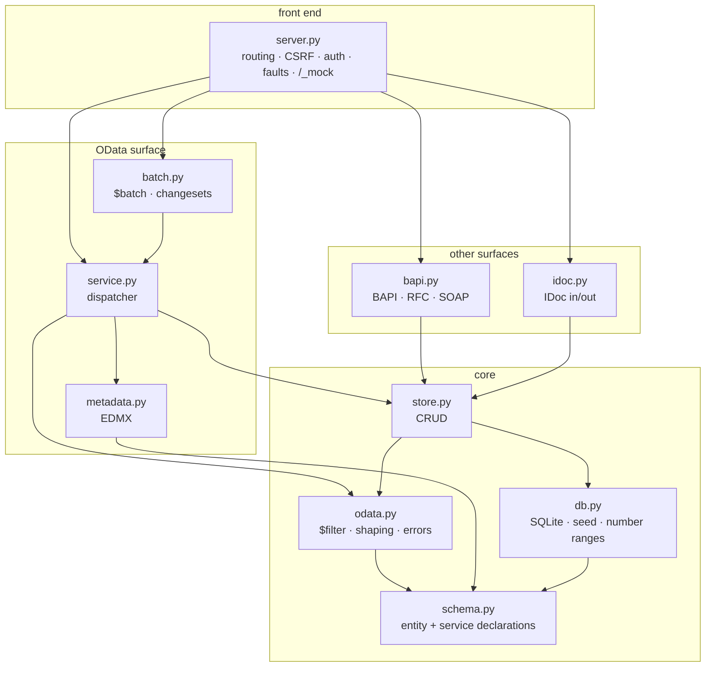
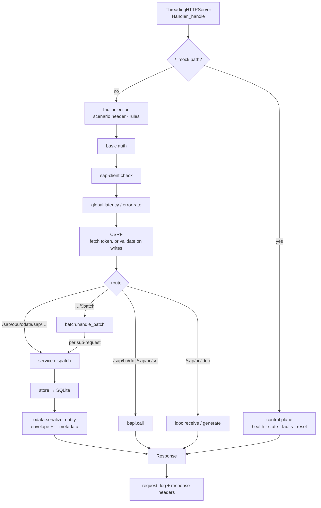

# Architecture

## What this thing is

A black box that speaks SAP's wire shapes. It receives requests in the formats an
SAP system accepts and answers in the formats an SAP system produces - and in
between it does nothing an SAP system would do. There is no ATP check, no pricing
procedure, no output determination, no authorization object. A sales order is a row.

That constraint is the design: every decision below optimises for *fidelity at the
boundary* and *simplicity behind it*.

Two more constraints shape everything:

- **No dependencies.** The Python standard library and SQLite, nothing else. A mock
  you cannot install is a mock nobody runs, so `python3 -m mocksap` works on a bare
  interpreter, in a locked-down CI image, behind a corporate proxy.
- **One source of truth for the shapes.** The entity definitions in `schema.py`
  drive the database schema, the `$metadata` document, the JSON payloads and the
  key handling. They cannot drift apart, because there is only one of them.

## The shape of the code

The arrows only ever point downwards. `schema.py` imports nothing from the package;
`server.py` imports nearly all of it. There are no cycles, which is what makes it
possible to test the dispatcher without a socket and the store without HTTP.

## The path of a request

Two things are worth pointing at.

**The cross-cutting checks run in a fixed order, and the order is deliberate.**
Fault injection comes first so that a simulated outage does not depend on
authenticating successfully; a real backend that is down is down for everyone. CSRF
comes last of the checks, because Gateway itself only validates the token once it
knows who you are.

**`service.dispatch()` takes a method, a path, a query string, headers and a body -
not an HTTP request object.** That is what lets `$batch` reuse the entire OData
implementation: a batch sub-request is parsed out of the multipart body and handed
to the same function the socket-facing handler calls. There is no second code path
for batched operations to drift away from.

## Decisions worth knowing about

### The schema is data, not code

`EntityType`/`Prop`/`Nav`/`Service` are plain dataclasses. `db.ddl_for()` turns an
entity type into `CREATE TABLE`, `metadata.metadata_document()` turns it into EDMX,
`odata.serialize_entity()` turns a row into the JSON an SAP client expects, and
`store` uses the key declarations to build predicates. Adding an entity set means
adding a declaration; nothing else has to be taught about it.

### `$filter` compiles to parameterised SQL

The filter parser is a small recursive-descent parser over a regex tokenizer,
producing a SQL `WHERE` fragment plus a list of bind values. Values are *never*
interpolated into SQL.

Each parse result is a `_Frag` that carries its own parameters in placeholder
order. That matters more than it looks: `endswith(a, b)` renders `b` twice in the
generated SQL, so the fragment has to contribute its bind value twice, in the right
position. An earlier version kept one shared parameter list and silently misbound
those queries - the fragment design makes the class of bug impossible rather than
merely fixed.

Filtering across navigation paths is rejected with a clear error rather than
half-supported.

### Changesets are atomic, via a snapshot

OData says a `$batch` changeset either fully applies or does not apply at all.
Implementing that with SQLite savepoints does not work here, because `store` commits
as it goes. So `batch._run_changeset()` takes a snapshot of the whole database with
SQLite's online backup API before the changeset runs, and restores it if any request
inside fails. The databases involved are small and the mock is not a production
store, which makes the blunt approach the right one.

### SAP's system behaviour is modelled where it is observable

A client cannot tell whether pricing ran, but it can tell whether the document
number came from a number range, whether items are numbered 10/20/30, whether
`TotalNetAmount` reflects the items, and whether unset fields come back as `""` and
`0.000` rather than `null`. So `store.py` implements exactly those: `AUTO_KEY` draws
document numbers, `_next_item_number` numbers items, `_recalculate_totals` keeps the
header consistent, `DOCUMENT_DEFAULTS` sets statuses the system would set, and
`_initial()` returns ABAP initial values. Anything the wire cannot reveal is absent.

### Links are a surface of their own

`$links` addresses an association rather than the entities behind it, so a read
answers with bare URIs and a write carries only `{"uri": …}`. The writes do not get
their own rule: `_write_link` works out which row owns the foreign key - the
dependent for a to-many navigation, this row for a to-one - and hands the change to
`store.update`, which already refuses to rewrite a key property. Every association
in the current schema is a composition (a sales order item's key contains its
order), so in practice re-pointing one is refused, exactly as SAP refuses it, while
setting a link to the target it already has succeeds.

### Errors are shapes too

A mock that returns a bare 400 teaches a client nothing. `odata.SapError` carries an
HTTP status and a `/IWBEP/CX_MGW_*` code, and `error_payload()` renders the full
Gateway envelope down to `innererror.errordetails` and the error-resolution hints.
BAPIs are different on purpose: their failures are `TYPE: "E"` records in a `RETURN`
table with a real message number and a 200 status, because that is how BAPIs fail.

### One connection, many threads

`ThreadingHTTPServer` handles requests concurrently against a single SQLite
connection opened with `check_same_thread=False`; SQLite serialises the access.
In-memory databases use a *uniquely named* shared-cache URI, so several mocks in one
process - which is exactly what the test suite does - stay isolated from each other
instead of silently sharing one database.

### The control plane is part of the product

`/_mock/*` is not a debug hatch, it is how the mock is used in tests: `reset`
restores a known dataset between cases, `requests` is a recording of what the client
actually sent, `faults` programs failures by regex, and the `sap-mock-scenario`
header does the same for a single call. Requests to `/_mock` are excluded from the
request log so that inspecting the log does not change it.

## Data and determinism

`db.seed()` generates business partners, addresses, products with descriptions and
plant data, sales orders with items and partners, and purchase orders with items -
all from a seeded `random.Random`, so the same `--seed` gives byte-identical data on
every run and in every process. Tests rely on that; so does anyone demoing.

The default database is in-memory and disappears on exit. `--db mock.db` keeps it.

## Extending

| To add | Edit | Notes |
| --- | --- | --- |
| An entity set | `schema.py` (declaration), `db.py` (seed rows) | Tables, `$metadata`, payload shapes and keys follow automatically. |
| A `$filter` function | `odata.py`, `_Filter.parse_function` | Return a `_Frag`; use `combine()` so repeated arguments bind correctly. |
| A BAPI | `bapi.py` | Decorate with `@function(NAME, CamelAlias)`; it becomes reachable over both JSON and SOAP, and the alias is what the SOAP spelling uses. |
| A failure scenario | `server.py`, `SCENARIOS` and `_inject_faults` | Add the documentation string too; `/_mock/services` serves the list. |
| An IDoc type | `idoc.py` | `_seg()` builds segments; follow `generate_orders05`. |

Each of these should come with a test in the matching `tests/test_*.py` module. A
new *file* also needs a row in [FILES.md](FILES.md) - `tools/check_docs.py` fails
the build otherwise, so the index cannot quietly fall behind the code.

## Where fidelity stops

Known gaps, each with an issue: OData V4 ([#1]), complex types ([#2]), ETags and
`If-Match` ([#4]), OAuth and SAML ([#5]). Beyond those, the mock
has no concept of authorizations, no ABAP, no background jobs, no transactional
boundary spanning more than a changeset, and no attempt at SAP's performance
characteristics. It is a wire-shape simulator, and it should stay one.

[#1]: https://github.com/rseufert/mock-sap/issues/1
[#2]: https://github.com/rseufert/mock-sap/issues/2
[#4]: https://github.com/rseufert/mock-sap/issues/4
[#5]: https://github.com/rseufert/mock-sap/issues/5
